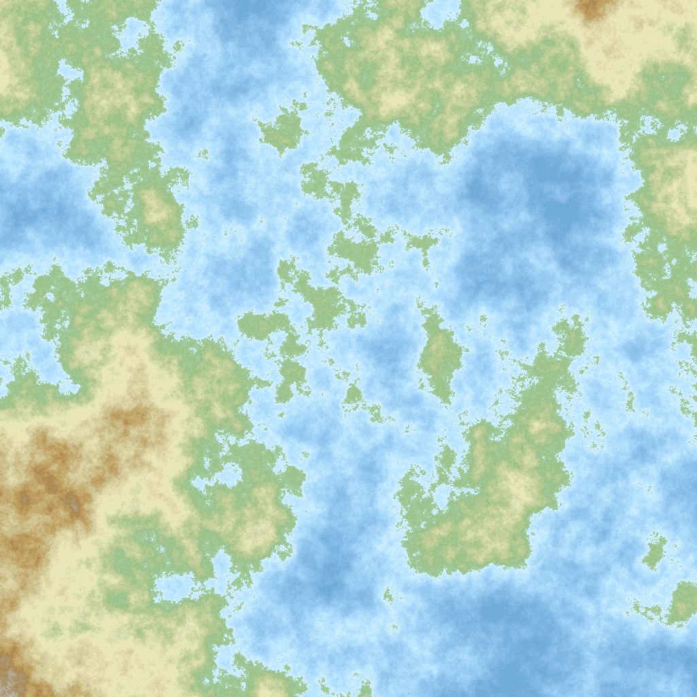

# Terrain generation program

Inspired by the python code provided [here](https://janert.me/blog/2022/the-diamond-square-algorithm-for-terrain-generation/).

See also [polygon map generation](http://www-cs-students.stanford.edu/~amitp/game-programming/polygon-map-generation/).

An image example.

